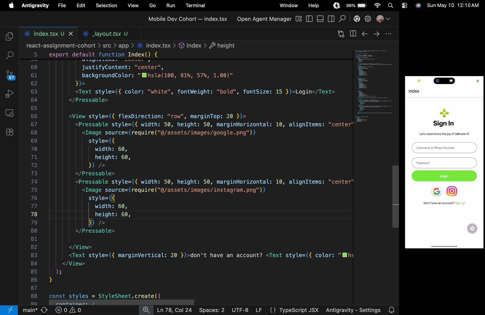

# Chai Code Mobile Dev Cohort Assignment

This repository contains a mobile application developed as part of the **Chai Code Mobile Development Cohort**. The project is built using **React Native** and **Expo**, demonstrating a modern UI for a "Telecare AI" sign-in screen.

## Features

- **Responsive UI:** A clean and modern sign-in interface.
- **Form Inputs:** Input fields for username/phone number and password.
- **Social Login:** Quick access buttons for Google and Instagram integration.
- **Theming:** Custom styling with a focus on usability and aesthetics.

## Screenshot



## Tech Stack

- **Framework:** React Native with Expo
- **Navigation:** Expo Router
- **Styling:** React Native StyleSheet
- **Language:** TypeScript

## Getting Started

### 1. Install Dependencies
```bash
npm install
```

### 2. Start the Development Server
```bash
npx expo start
```

### 3. Run on Device/Emulator
Follow the Expo CLI instructions to run the app on iOS, Android, or Web.

---
*Created for the Chai Code Mobile Dev Cohort.*
